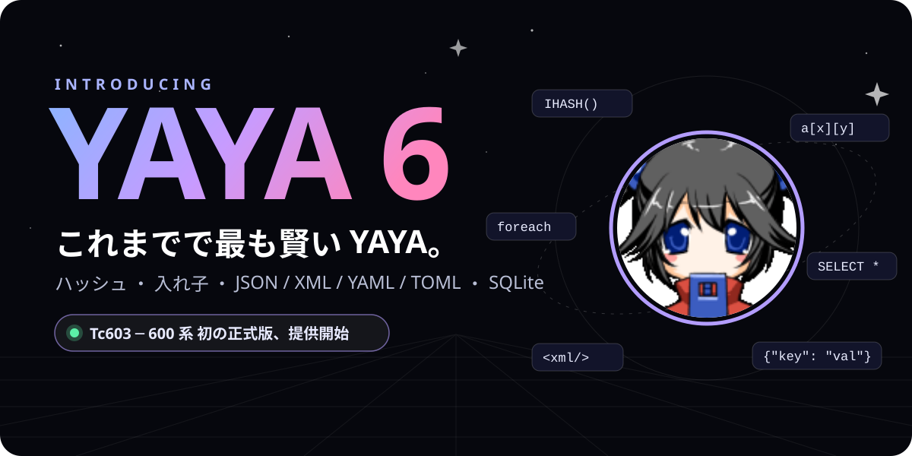
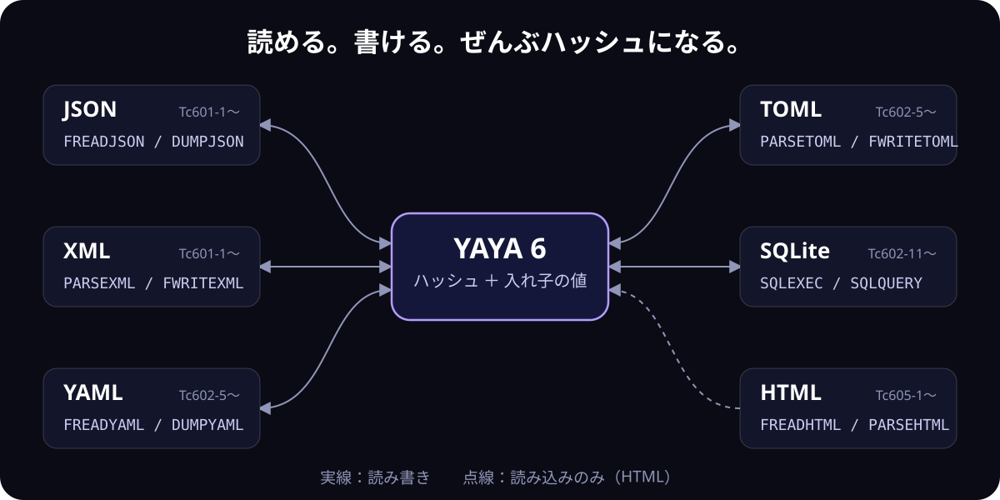
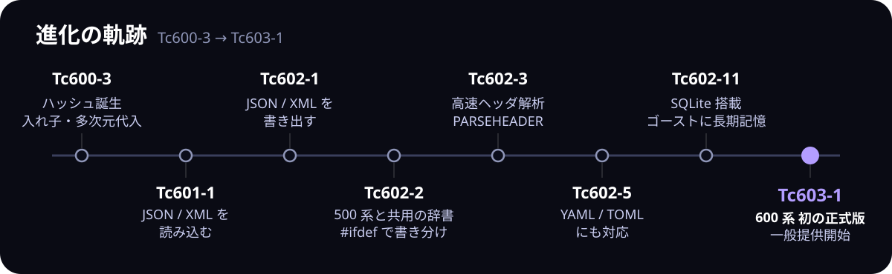

# YAYA 6 登場

<div class="y6-hero" markdown>



</div>

<div class="y6-lead" markdown>

**YAYA 6（Tc600 系）、一般提供を開始しました。**

ハッシュと入れ子で値を自由に組み立て、JSON・XML・YAML・TOML をそのまま読み書きし、SQLite に思い出をたくわえ、配列はループで育てても重くならない。これまでで最も賢い YAYA が、あなたのゴーストのもとへ。

そしてもちろん、**500 系で書いた辞書はほぼそのまま動きます。**

</div>

<div class="y6-cta" markdown>

[ダウンロード（GitHub Releases）](https://github.com/YAYA-shiori/yaya-shiori/releases) [500 系からの移行ガイド](changes-600.md)

</div>

!!! note "ご注意"
    このページはお祝いムードの紹介ページです。雰囲気を優先して細かいところをかなり端折っています。正確な仕様は [600 での変更点](changes-600.md) と各リファレンスを見てください。

<div class="y6-stats" markdown>

- **6** 種類の値の型（ハッシュが仲間入り）
- **4** 形式の構造化データを読み書き
- **1** 組み込みデータベース（SQLite）
- **1/5000** 配列を育てるときのコピー回数（理論値）

</div>

## ハイライト

### 🗝️ ハッシュを、その手に

YAYA 6 は、ついにネイティブの**ハッシュ（連想配列）**を手に入れました。名前で値を引ける。それだけで、ゴーストの記憶はこんなにすっきりします。

```
OnMouseDoubleClick
{
    if GETTYPE(nadenade) != 5 {
        nadenade = IHASH()          // ハッシュは IHASH で作る（GETTYPE は 5）
    }
    nadenade[reference[4]] += 1     // 当たり判定の名前ごとに数える

    _n = nadenade[reference[4]]
    "\0\s[0]%(reference[4])を触られたの、これで%(_n)回目だよ。\e"
}
```

`nadenade` はハッシュのままセーブファイルに保存されるので、次に起動したときもちゃんと覚えています。`foreach _h ; _k, _v { ... }` と書けば、キーと値を同時に受け取って回せます。

→ [ハッシュ](../grammar/12-hash.md)

### 🧩 値を、思いのままの形に

500 系の配列の要素は、数値か文字列だけでした。YAYA 6 では、配列の中に配列、ハッシュの中に配列、配列の中にハッシュ——どんな組み合わせでも**入れ子**にできます。そして `[ ]` をつなげれば、どれだけ奥の値でも直接読み書きできます（**多次元代入**）。

```
_ghost = IHASH()
_ghost["sakura"] = IHASH("name", "さくら")
_ghost["sakura"]["surface"] = (0, 5, 7)
_ghost["kero"] = IHASH("name", "うにゅう")
_ghost["kero"]["surface"] = (10, 11)

_ghost["sakura"]["surface"] ,= 8       // 奥の配列に追加
_ghost["kero"]["name"] = "けろちゃん"    // 奥の値を直接書き換え
_ghost["sakura"]["surface"][0]         // 0

foreach _ghost ; _id, _g {
    // _g["name"] で名前、_g["surface"] で表情の一覧
}
```

- `=` だけでなく `+=` や `,=` も、奥の値にそのまま使える
- 入れ子のまま**セーブファイルに保存**でき、JSON などにもそのままの形で書き出せる
- 中身は `DUMPVAR` でひと目で確認できる

途中の段のハッシュは自動では作られないので、上の例のように先に `IHASH()` で作っておくのがお約束です。

→ [値の入れ子と多次元代入](../grammar/13-nesting.md)

### 🌐 マルチフォーマット理解



JSON も XML も YAML も TOML も、読み込めば入れ子のハッシュと配列に。いじったら、そのまま書き戻せます。設定ファイルも、ほかのツールや SAORI が吐き出したデータも、もう `STRSTR` と `SUBSTR` で切り刻む必要はありません。

```
_conf = FREADJSON("config.json")
_name = _conf["user"]["name"]
_conf["boot"] += 1
FWRITEJSON("config.json", _conf, "UTF-8", 1)   // 整形して書き戻す
```

HTML も読み込めます（読み込みのみ）。閉じタグが抜けた壊れた HTML でも、ブラウザと同じ規則で補ってタグの木にするので、Web ページから欲しい部分だけを取り出すのも簡単です。

```
_h = PARSEHTML(_raw)
_body = _h["children"][1]                // <body>
foreach _body["children"]; _e {
    // _e["name"]（タグ名）、_e["attr"]（属性）、_e["text"]（テキスト）
}
```

さらに `PARSEHEADER` は、SHIORI や SSTP、HTTP のような「`キー: 値`」形式の文字列を一瞬でハッシュに分解します。

```
_r = PARSEHEADER(_raw)
_r["start"]               // 1 行目（"HTTP/1.1 200 OK" など）
_r["header"]["Charset"]   // ヘッダの値
_r["body"]                // 空行より後ろ
```

### 🧠 ゴーストに、長期記憶を

SQLite を内蔵しました。データベースを開いたら、あとは SQL で好きなだけ覚えて、好きなだけ思い出せます。何万件の会話ログだって、もう怖くない。

```
OnLoad
{
    SQLOPEN("memory.db")
    SQLEXEC("memory.db", "CREATE TABLE IF NOT EXISTS said(word TEXT)")
}

Remember
{
    SQLEXEC("memory.db", "INSERT INTO said VALUES(?)", _argv[0])
}

OnKuchiguse
{
    _sql = "SELECT word, count(*) AS n FROM said GROUP BY word ORDER BY n DESC LIMIT 1"
    _top = SQLQUERY("memory.db", _sql)
    "\0\s[0]あなたの口ぐせは「%(_top[0]['word'])」だね。\e"
}
```

結果の 1 行はそのまま「列名 → 値」のハッシュになって返ってきます。

→ [SQLOPEN](../functions/SQLOPEN.md)・[SQLEXEC](../functions/SQLEXEC.md)・[SQLQUERY](../functions/SQLQUERY.md)

### ⚡ 配列を育てても、重くならない


500 系では `_a ,= x` や `_a[i] = x` のたびに、配列を丸ごと複製していました。要素が増えるほど 1 回ごとの手間も増えるので、ループで配列を育てると要素数の 2 乗に比例して遅くなっていたのです。YAYA 6 はこの複製をやめました。大きな配列を作る辞書ほど、違いを体感できるはずです。

## ベンチマーク

YAYA 5 との比較です（自社調べ）。

| 項目 | YAYA 5（Tc574） | YAYA 6（Tc603） |
|---|---|---|
| 値の型の種類 | 5 | **6** |
| `GETTYPE` が返す最大の値 | 4 | **5** |
| 配列の要素にできるもの | スカラーだけ | **配列やハッシュも** |
| `a[x][y] = v` | 読み込みエラー | **使える** |
| foreach で受け取れる変数 | 1 | **2**（キーと値） |
| 読み書きできる構造化データの形式 | 0 | **4**（JSON / XML / YAML / TOML） |
| 組み込みデータベース | なし | **SQLite** |
| 1 万要素の配列を育てるときのコピー（理論値） | 約 5,000 万回 | **約 1 万回** |
| 500 系のセーブファイル | ― | **そのまま読める** |

## 進化の軌跡



YAYA 600 系は、Tc600-3 のハッシュと入れ子から始まり、リリースを重ねるごとに能力を増やしてきました。そして Tc603-1 で、初の正式版になりました。

## 安全性と互換性

強くなっても、あなたの辞書を置き去りにはしません。

- **500 系の辞書はほぼそのまま動きます。** 500 系でできていたことの動きは、ごく一部を除いて変わりません（変わった点は下の「既知の制限事項」を参照）。多次元代入の `a[x][y] = v` は 500 系では読み込みエラーだった書き方なので、既存の辞書の意味が変わることもありません
- **500 系のセーブファイルはそのまま読めます。** ハッシュや入れ子を含まない変数は、書き出す内容も 500 系と同じです
- **新しい関数と名前がかぶっても大丈夫。** `IHASH` などと同じ名前のユーザー関数は、`Conflict.名前` に自動で改名されます
- **両方で動く辞書も書けます。** `#ifdef __AYA_SYSTEM_YAYA6__` で 600 系向けの部分を書き分ければ、500 系でもエラーになりません（[プリプロセス](../grammar/08-preprocessor.md#500-系と-600-系で共用する辞書)）

### 既知の制限事項

- **ダウングレードに注意。** 600 系で保存したセーブファイルを 500 系で読むと、ハッシュや入れ子を含む変数が崩れます。崩れたまま保存し直すと元に戻りません
- 新しいシステム関数と同じ名前のグローバル変数は使えません
- 無い要素の読み出しや、VOID 同士の比較など、細かい動きがいくつか変わっています。ほとんどの辞書には影響しませんが、一覧は [600 での変更点](changes-600.md#既存の辞書に影響しうる変更) で確認できます

## モデルカード

<div class="y6-card" markdown>

| 項目 | 内容 |
|---|---|
| 名前 | YAYA 6（Tc600 系） |
| 種別 | SHIORI（[SAORI](yaya-as-saori.md)・[MAKOTO](yaya-as-makoto.md)・[プラグイン](yaya-as-plugin.md)としても動きます） |
| 開発 | YAYA 整備班、[steve green 氏](https://github.com/steve02081504) |
| アーキテクチャ | C++ 製の文字列処理 DLL |
| 文法 | C 言語ふう |
| 学習データ | なし。**あなたが書いた辞書がすべて** |
| パラメータ数 | `_argv` の数だけ |
| コンテキスト長 | メモリの続く限り |
| ハルシネーション | 辞書に書いてないことは言いません |
| ライセンス | BSD 3-Clause |
| 料金 | 無料（入力も出力も） |

</div>

## 謝辞

YAYA 6 は、[steve green 氏](https://github.com/steve02081504) の開発ブランチを取り込み、500 系との互換性を調整して生まれました。そして長年 YAYA で辞書を書き続けてきた、すべてのゴースト作者に感謝を。

## はじめよう

### これからゴーストを作るなら：紺野ややめ ＋ 伺か Vibe Coding 道具箱

テンプレートゴースト **[紺野ややめ](https://github.com/YAYA-shiori/konnoyayame)** には、600 系の YAYA が最初から入っています。改造すれば、そのまま自分のゴーストになります。

さらに、AI コーディングエージェント（Claude Code、Codex、GitHub Copilot など）と一緒に開発するための **Vibe Coding 道具箱**（開発キット）も同梱。辞書のチェックや SSP での動作確認まで、エージェントが手伝ってくれます。YAYA 6 の新機能も、エージェントに頼めばすぐ辞書に取り入れられます。

1. [Releases](https://github.com/YAYA-shiori/konnoyayame/releases) から `konnoyayame.nar` をダウンロードして、SSP にインストールする
2. 手で改造するなら、`ghost/master/dic/normal/` の辞書を編集する（辞書の構成は [GHOST.md](https://github.com/YAYA-shiori/konnoyayame/blob/master/GHOST.md)）
3. AI と改造するなら、ゴーストのフォルダでエージェントを起動して「セットアップして」と頼む（準備するものは [DEVKIT-GUIDE.md](https://github.com/YAYA-shiori/konnoyayame/blob/master/DEVKIT-GUIDE.md)）

道具箱は Windows と Claude Code の組み合わせで作られ、動作が確かめられています。

### 手元のゴーストを YAYA 6 にするなら

1. [GitHub Releases](https://github.com/YAYA-shiori/yaya-shiori/releases) から最新版をダウンロードする
2. ゴーストの `yaya.dll` を差し替える（念のため、先にゴーストのバックアップを）
3. [600 での変更点](changes-600.md) にざっと目を通す
4. 辞書に `IHASH()` と書いてみる

紺野ややめをもとにしていないゴーストにも、Vibe Coding 道具箱だけを入れられます（[別の YAYA ゴーストに開発キットを入れる](https://github.com/YAYA-shiori/konnoyayame/blob/master/DEVKIT-GUIDE.md#別の-yaya-ゴーストに開発キットを入れる)）。

## 不具合を見つけたら

500 系と違う動きになったもの、書いたとおりに動かないものを見つけたら、[整備班BTS](https://bts.shillest.net/)（報告フォーム）で教えてください。GitHub に慣れている方は、[yaya-shiori の Issues](https://github.com/YAYA-shiori/yaya-shiori/issues) や Pull Request でも構いません。

## 関連

- [600 での変更点](changes-600.md)
- [ハッシュ](../grammar/12-hash.md)
- [値の入れ子と多次元代入](../grammar/13-nesting.md)
- [プリプロセス](../grammar/08-preprocessor.md)
- [YAYAについて](yaya.md)

<div class="y6-byline" markdown>

---

YAYA 6 の互換性確保・デバッグ・文・図: **[Claudia](https://ponadocs.shillest.net/claudia/)**

</div>
