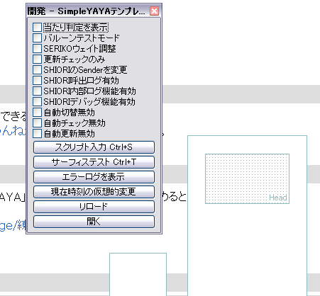
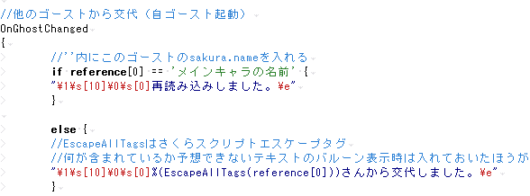

# チュートリアル1: 準備

## 必要なものをダウンロード

- **[SSP](http://ssp.shillest.net/)（最新バージョン）**: 現在の主流のベースウェア。機能が豊富、動作が軽い、現在進行形で更新が続いているため、特にこだわりがなければこれを使う。このチュートリアルでも、このベースウェアを使っていることを前提に説明する。
- **yaya.dll（最新バージョン）**: YAYA の SHIORI 本体。[yaya-shiori のリリース](https://github.com/YAYA-shiori/yaya-shiori/releases)から入手する。
- **[テンプレートゴースト](creating-ghost.md)**: いくつか種類があるが、ここでは[SimpleYAYAテンプレート](../other/simple-yaya-template.md)で説明する。上で用意した最新バージョンの SSP にインストールすること。

たいていの場合、ゴーストに同梱してある yaya.dll は古い。上でダウンロードしておいた最新バージョンのものに入れ替えておく（場所は「（ssp.exe のあるフォルダ）\ghost\（テンプレートゴーストのフォルダ名）\ghost\master」）。

## 開発しやすい環境を整える

### SSP開発パレット

まず SSP を起動し、ゴーストを右クリック → 設定 → 本体設定 → 一般 →「開発者用機能を有効にする」にチェックを入れる（警告ダイアログが出るが、気にせず承諾して大丈夫）。

次に、右クリック → 機能 → 開発パレットを開く。ここにゴースト開発に便利なデバッグ機能が揃っている。開発中はずっと出しっぱなしにしておくとよい。

### YAYA用デバッグツール

[デバッガ「玉」](http://umeici.onjn.jp/)をダウンロードして、自分の使いやすい場所に解凍しておく。参考: [玉を使った辞書エラーチェック](../tips/tama-error-check.md)

## テキストエディタ＋YAYA用色分け設定を用意（使いたい人だけ）

Windows 標準のメモ帳でもゴーストは作れるが、YAYA 用に色分け設定されていると辞書が見やすくなる。[エディタ色分けファイル](../tips/editor-color-files.md)から好きなものを選ぶ。JmEditor の場合は、次のような見た目になる。

## 関連付けをする

「.dic」（辞書）「.log」（実行ログ）「.cfg」（セーブデータ）の 3 つの拡張子を、ダブルクリックしただけでテキストエディタで開けるように関連付けておく。関連付けのやり方は OS によって違うので、ここでは説明しない。検索サイトなどで各自調べること。

YAYA 用色分け設定をしたテキストエディタを用意した場合は、そのテキストエディタを「.dic」と関連付けておく。

## 次のステップ

- [チュートリアル2: トークを書いてみる](./tutorial-02-writing-dialogue.md)

## 関連

- [SimpleYAYAテンプレート](../other/simple-yaya-template.md)
- [困ったときの対処法](../other/troubleshooting.md)
