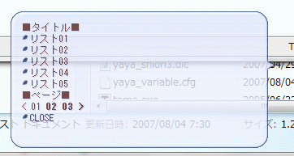

# ページング

> [AYAYA Wiki](https://emily.shillest.net/ayayaold/) より転載

- AYAで、用語リストなどをページングするための簡単な関数を書いてみました。
- 大雑把な実装ですがよければどうぞ。
- YAYAで動作確認していますが高度な関数は使って無いのでAYAでも動くと思います。
- 添付ファイルから持っていってください。ライセンスは何してもＯＫです。
- 追記(2018/03/01) バグ修正しました



```
///////// 文　ページャ　汎用関数
///////// written by ukiya.
///////// 2007/08/04 version 1.0	新規作成
///////// 2018/03/01 version 1.1 CEILの処理とリストの最後に空白が挿入されるバグを修正(Nao)
//*****************************************************************************
//	OnShowPage
//	ページャ用独自イベント
//	ref.0	表示するリストの先頭のインデックス
//	PAGER. で始まる変数に設定を入れて呼ぶ
//	ページングされると再度OnShowPageを呼ぶ
//*****************************************************************************
OnShowPage{
	_list =PAGER.List
	_start=TOINT(reference0)
	_end  =_start+PAGER.ShowNum
	_max  = TOREAL(ARRAYSIZE(_list))//CEILの処理用にdouble型にしておく。これがないとint同士の演算で余りが常に切り捨てになってしまう

	//リスト作成
	_showlist=''
	for _i=_start ; _i<_end ; _i++ {
		if  _i >= _max - 1 {//ここの等号が抜けていたので追加
			break
		}
		_key=_list[_i][0,PAGER.Separator]
		_val=_list[_i][1,PAGER.Separator]
		_showlist += "%(PAGER.Marker)\q[%(_key),%(_val)]\n"
		//SSP2.00.15以降なら以下のようにすればマーカーも押せる
		//_showlist+="\__q[%(_val)]%(PAGER.Marker)%(_key)\__q\n"
	}

	//nowpageは0はじまり
	//maxpageはページ個数でなくインデックス
	_nowpage  =TOINT(_start / PAGER.ShowNum)
	_startpage=_nowpage-TOINT(PAGER.PageNum/2)
	_maxpage  =CEIL(_max/PAGER.ShowNum) - 1	//インデックスなので-1

	_prevstr=''
	_nextstr=''

	//さらに前のページはあるか？
	if _startpage < 0 {
		_startpage=0
		_prevstr='< '
	}else{
		_prevpage=_nowpage-PAGER.PageNum
		if _prevpage < 0 {
			_prevpage=0
		}
		_prevstart=_prevpage * PAGER.ShowNum
		_prevstr="\f[bold,true]\q[<,OnShowPage,%(_prevstart)]\f[bold,false] "
	}


	//さらに後のページはあるか？
	_endpage=_startpage+PAGER.PageNum-1	//インデックスなので-1
	if _endpage >= _maxpage {
		_endpage=_maxpage
		_nextstr='> '
	}else{
		_nextpage=_nowpage+PAGER.PageNum
		if _nextpage >= _maxpage {
			_nextpage=_maxpage
		}
		_nextstart=_nextpage * PAGER.ShowNum
		_nextstr="\f[bold,true]\q[>,OnShowPage,%(_nextstart)]\f[bold,false] "
	}


	//ページリスト作成
	_pagelist=''
	for _i=_startpage ; _i<=_endpage ; _i++ {
		//インデックスなので <=
		_pagestr=''
		if _i < 10 {
			_pagestr='0'+TOSTR(_i+1)	//0はじまり->1はじまり
		}else{
			_pagestr=TOSTR(_i+1)	//0はじまり->1はじまり
		}

		if _i == _nowpage {
			_pagelist+=_pagestr+' '
		}else{
			_pagestart=_i*PAGER.ShowNum
			_pagelist+="\f[bold,true]\q[%(_pagestr),OnShowPage,%(_pagestart)]\f[bold,false] "
		}
	}

	//最終出力
	"%(PAGER.ShowHeader)%(_showlist)%(PAGER.PageHeader)%(_prevstr)%(_pagelist)%(_nextstr)%(PAGER.Footer)"
}


//**** デバッグ用 *************************************************************

OnKeyPress{
	_TESTARRAY = ( /
        "リスト01|list1", /
        "リスト02|list2", /
        "リスト03|list3", /
        "リスト04|list4", /
        "リスト05|list5", /
        "リスト06|list6", /
        "リスト07|list7", /
        "リスト08|list8", /
        "リスト09|list9", /
        "リスト10|lista", /
        "リスト11|listb", /
        "リスト12|listc", /
        "リスト13|listd", /
        "リスト14|liste", /
        "リスト15|listf", /
        "リスト16|listg", /
        "リスト17|listh", /
        "リスト18|listi", /
        "リスト19|listj", /
        "リスト20|listk", /
        )
	CVSTR(reference0)
	case reference0 {
		when 'd' {
			//PAGER.Listに表示したいリストを入れる。
			PAGER.List = IARRAY
			for _i = 0; _i <ARRAYSIZE(_TESTARRAY) ; _i++{
				PAGER.List = (PAGER.List,_TESTARRAY[_i])
			}
			PAGER.ShowHeader='\_q■タイトル■\n'		//リストヘッダ
			PAGER.PageHeader='■ページ■\n'		//ページヘッダ
			PAGER.Footer='\n\![*]\q[CLOSE,close]\_q'	//フッタ
			PAGER.Marker='\![*]'					//項目マーカ
			PAGER.Separator='|'						//項目名と選択肢名の区切り
			PAGER.ShowNum=6							//リスト表示数
			PAGER.PageNum=5							//ページ表示数（奇数で）
			reference0=0							//初期表示時のおまじない
			OnShowPage								//初期表示コール
		}
	}
}
```

## 添付ファイル

- [aya_pager.dic](../attachment/aya_pager.dic)
- [aya_pager_new.dic](../attachment/aya_pager_new.dic)
- [pager.png](../attachment/pager.png)
