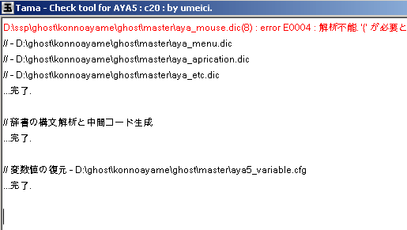
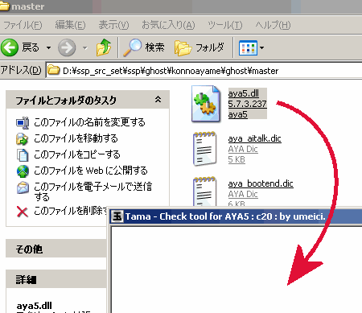

# 玉を使った辞書エラーチェック

> [AYAYA Wiki](https://emily.shillest.net/ayayaold/) より転載

## 「玉」を使った辞書エラーチェック

デバッグツール「玉」を使うことで簡単にエラーを検出できます。

- [玉改良プロジェクト](https://github.com/nikolat/tama)　右側のReleasesからダウンロードできます。
- [「玉」配布サイト](http://umeici.onjn.jp/)　「tama(debugger for aya)」からダウンロードできます

### 手順1

#### 1.玉を起動する

**ゴーストを起動する前に**玉を起動してください。

#### 2.ゴーストを起動する

エラーがなければ恐ろしい勢いでメッセージが流れていきます。<br>
エラーがあれば赤文字で何か表示されます。

#### 3.出てきたエラーを見る



オレンジ色は警告、赤は致命的なエラーです。<br>
オレンジは一応動作するのですが、赤は**ゴーストが動作不能になる致命的なエラー**ですので修復する必要があります。

```
aya_mouse.dic(8) : error E???? ...
```

いちばん左がエラーの起きた辞書ファイル名、括弧の中が何行目かを示します。

### 手順2

#### 1.ゴーストを終了する

**開発中のゴーストなどがあればすべて終了**してください。<br>
「玉」は実行状況を表示するツールにもなりますので、現在実行中のゴーストがあると恐ろしい勢いで表示が流れていきます。

#### 2.AYAのDLLを玉にドロップする



辞書ファイルではなく、DLLをドロップしてください。

#### 3.出てきたエラーを見る

手順1の3.と同じです。

### おまけ - 右クリックメニュー解説

**jump to Top**：いちばん上にスクロールします。

**jump to Bottom**：いちばん下にスクロールします。

**Copy to clipboard**：内容をクリップボードにコピーします。

**receiVe**：~

起動中のゴーストの動作状況を表示します。<br>
ゴーストを起動させたまま玉でいろいろ作業したい場合はこのチェックマークを切るとよいでしょう。

**reQuest dialog**：マニアックな開発者向けのデバッグ用です。普通は使わないでください（をい

**Reload(unload and load)**：再読み込みします。辞書を書き換えて再度チェックしたい場合は、いちいちDLLのドロップをしなくてもこのメニューで一発です。

**Unload**：読み込まれたAYAを開放します。普通は使う必要はないでしょう。

**eXit(auto unload)**：終了します。ウインドウの×マークでも同じ動作です。

## 添付ファイル

- [Image1.png](../attachment/Image1.png)
- [Image2.png](../attachment/Image2.png)
